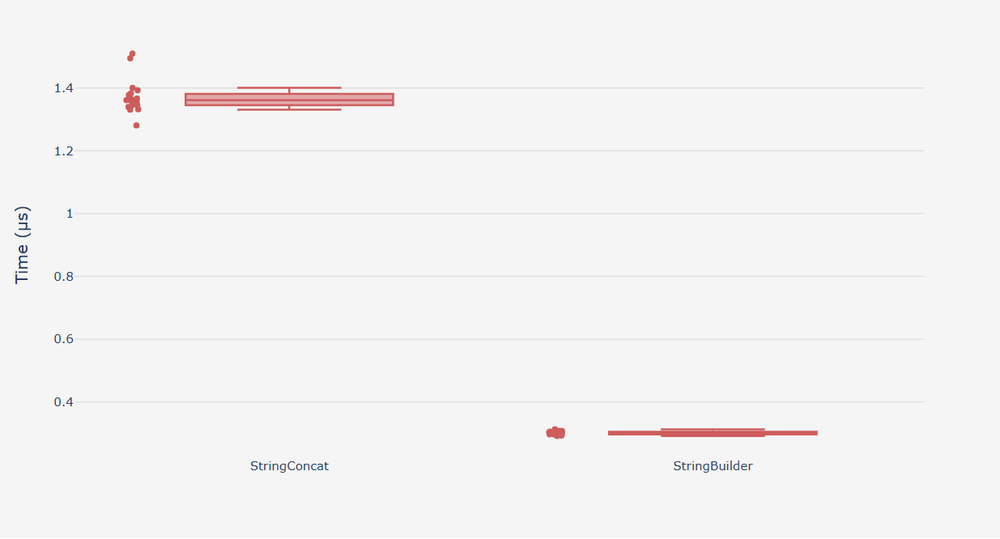

Testing performance of **.NET code** usually means measuring **execution time, memory usage, CPU usage, and scalability** under different conditions. The best approach depends on what you want to test (a single method vs. a full web API). Here are the most common and reliable methods.

## 1. Micro-benchmarking with BenchmarkDotNet (Best for methods/functions)

BenchmarkDotNet

This is the **most popular tool for benchmarking .NET code**. It runs your code many times, warms up the JIT compiler, and produces statistically reliable results.

```
dotnet add package BenchmarkDotNet
```

```
using BenchmarkDotNet.Attributes;
using BenchmarkDotNet.Running;

public class StringBenchmarks
{
    [Benchmark]
    public string StringConcat()
    {
        string s = "";
        for (int i = 0; i < 100; i++)
            s += i;
        return s;
    }

    [Benchmark]
    public string StringBuilder()
    {
        var sb = new System.Text.StringBuilder();
        for (int i = 0; i < 100; i++)
            sb.Append(i);
        return sb.ToString();
    }
}

public class Program
{
    public static void Main()
    {
        BenchmarkRunner.Run<StringBenchmarks>();
    }
}
```

Results look like this:

```
| Method        | Mean       | Error    | StdDev   |
|-------------- |-----------:|---------:|---------:|
| StringConcat  | 1,384.4 ns | 26.63 ns | 34.63 ns |
| StringBuilder |   292.0 ns |  5.78 ns |  8.82 ns |

// * Hints *
Outliers
  StringBenchmarks.StringConcat: Default  -> 3 outliers were removed, 4 outliers were detected (1.31 us, 1.49 us..1.55 us)
  StringBenchmarks.StringBuilder: Default -> 1 outlier  was  removed, 2 outliers were detected (275.20 ns, 324.99 ns) 

// * Legends *
  Mean   : Arithmetic mean of all measurements
  Error  : Half of 99.9% confidence interval
  StdDev : Standard deviation of all measurements
  1 ns   : 1 Nanosecond (0.000000001 sec)

// ***** BenchmarkRunner: End *****
Run time: 00:00:55 (55.54 sec), executed benchmarks: 2

Global total time: 00:01:03 (63.29 sec), executed benchmarks: 2
```

You can also use the Benchly for graphic results.

Add package for Benchly
```
dotnet add package Benchly
```

And add attributes:
```
using Benchly;

  

[ColumnChart]

[Histogram]

[BoxPlot]

public class StringBenchmarks

{

    [Benchmark]

    public string StringConcat()
```

Sample output:

